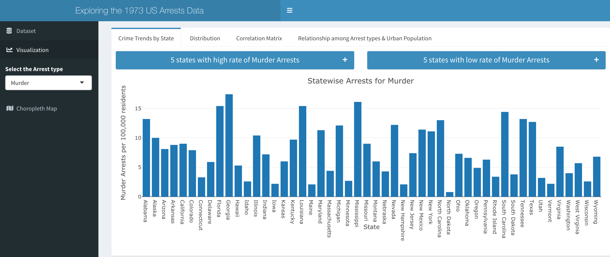
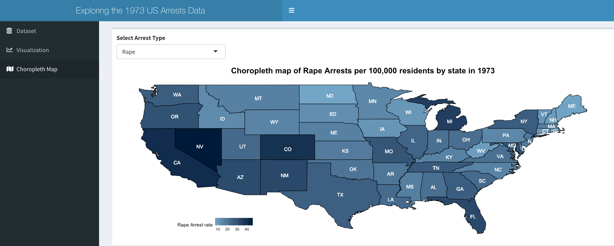

<!-- README.md is generated from README.Rmd. Please edit that file -->

# aliapp

The goal of the package ‘aliapp’ is to visualize and explore the 1973 US
Arrests data using an interactive dashboard made by R and Shiny. The
dataset used here is an in-built dataset in base R.

## Installation

You can install the development version of aliapp from
[GitHub](https://github.com/) with:

``` r
# install.packages("devtools")
devtools::install_github("Saqlainrocks7/R_App")
```

Summary of the Dataset

``` r
summary(USArrests)
#>      Murder          Assault         UrbanPop          Rape      
#>  Min.   : 0.800   Min.   : 45.0   Min.   :32.00   Min.   : 7.30  
#>  1st Qu.: 4.075   1st Qu.:109.0   1st Qu.:54.50   1st Qu.:15.07  
#>  Median : 7.250   Median :159.0   Median :66.00   Median :20.10  
#>  Mean   : 7.788   Mean   :170.8   Mean   :65.54   Mean   :21.23  
#>  3rd Qu.:11.250   3rd Qu.:249.0   3rd Qu.:77.75   3rd Qu.:26.18  
#>  Max.   :17.400   Max.   :337.0   Max.   :91.00   Max.   :46.00
```

Here are some functionalities of the app shown below:





