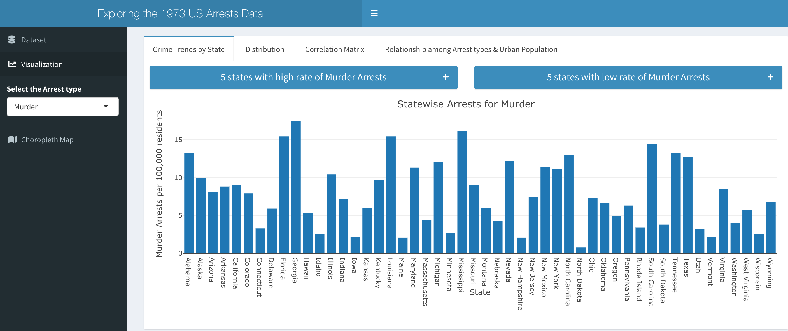
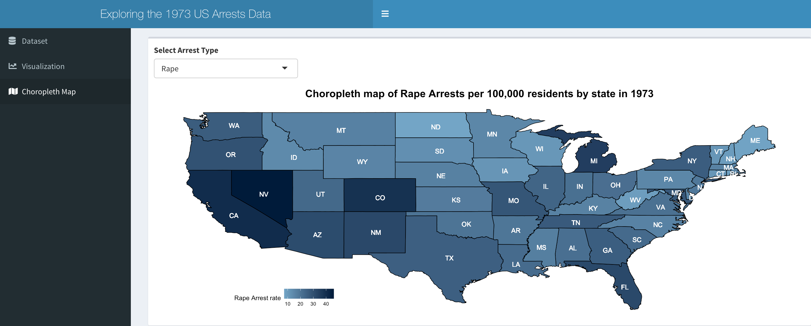

```{r, include = FALSE}
knitr::opts_chunk$set(
  collapse = TRUE,
  comment = "#>"
)
```

```{r setup}
library(aliapp)
```


```
At first we try to build the UI elements for the Shiny App which is saved in 'ui.R' file in the R folder.
The 'dashboardPage' helps to build the landing page of the Shiny App. The 'dashboardHeader' helps to set the title of the app. The 'dashboardSidebar' helps to build the different menu items to choose from and apply filters for other functionalities.
```


```
The dataset used here is an in-built dataset in base R. This data set contains statistics, in arrests per 100,000 residents for assault, murder, and rape in each of the 50 US states in 1973. Also given is the percent of the population living in urban areas.
```


```
A new column variable 'state' is added into the dataset. This will be used later to merge the dataset with US states map data. This data manipulation is done in 'global.R' file.
```


```
The 'output$top5' function will help us to visualize the top 5 states with highest rate of arrests of different kinds. The 'output$low5' function will help us to visualize the top 5 states with lowest rate of arrests of different kinds. It depends upon the user which kind of arrest type they want by filtering or choosing from the dropdown menu on the side of the app.
```


```
The 'output$bar' function will help us to build a bar chart statewise to visualize the number of a particular arrest. In the X-axis we have put different states and in the Y-axis there is number of arrests per 100,000 residents.
```





```
The 'output$histplot' function will help us to build a histogram as well as a boxplot plotted on top of each other. This will be a distribution chart showing mean, median etc. of any arrest type chosen from the dropdown menu.
```


```
The 'output$cor' function will help us to plot a correlation matrix of the various columns present in this data.
```


```
The 'output$scatter' function will help us to visualize the relation between two variables using a scatter plot. The user can choose the X variable, which is the arrest type and Y variable which is the urban population. The variables can be chosen by the user from the dropdown menu on the left side of the app.
```


```
A choropleth map (also called a color theme) is a thematic map in which administrative areas are colored or shaded according to the range in which the aggregated statistic of interest falls. The 'output$map_plot' function will help us to visualize the map of USA statewise and show different states shaded according to the rate of arrests of different kinds chosen by the user.
```

```
Preparing data for Arrests Map in 'global.R' file:
1. map data for US states boundaries using the maps package
2. map_data from ggplot package
3. map_data() converts data fom maps package into a dataframe which is used for mapping
```


